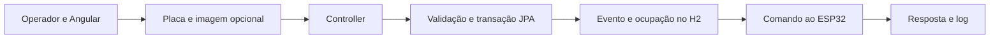

# Arquitetura e modelo de dados

Referências: anotações `Java e Spring boot.pdf` e documentação `EstacionaTec - Correções.docx`, incluindo DER, casos de uso e requisitos. Mantivemos a versão do Spring Boot já escolhida no projeto; as anotações orientaram as camadas, entidades e repositórios JPA.

```text
src/main/java/br/gov/sp/fatec/itu/estacionatec_api/
├── EstacionatecApiApplication.java
├── config/          Segurança e carregamento do JSON
├── controllers/     Rotas HTTP e delegação aos serviços
├── dto/             Contratos de entrada e resposta para Angular
├── entities/        Entidades JPA com campos privados e acessores
├── exceptions/      Regras de negócio e respostas de erro
├── integration/     Clientes HTTP da câmera e do ESP32
├── repositories/    Interfaces JpaRepository e consultas JPA
├── security/        Sessões, tokens e perfis
└── services/        Regras, transações, arquivos e auditoria

src/main/resources/
├── application.properties
└── data/dados-teste.json

src/test/java/br/gov/sp/fatec/itu/estacionatec_api/
├── EstacionatecApiApplicationTests.java
├── FluxoEstacionamentoTests.java
└── HardwareClientTests.java
```

DTOs usam nomes compatíveis com o Angular; entidades e regras usam português. Não há Lombok. As entidades possuem construtores, getters/setters e identidade JPA com `GenerationType.IDENTITY`.

## Tabelas H2

| Tabela | Conteúdo e vínculos |
| --- | --- |
| `pessoas` | Nome, documento único quando informado, e-mail, telefone, matrícula, categoria e estado ativo. |
| `perfis` | Administrador, Porteiro e Usuário. |
| `usuarios` | Chaves estrangeiras de pessoa e perfil, username único, hash de senha e estado ativo. |
| `veiculos` | Pessoa proprietária, placa única normalizada, marca, modelo, cor, tipo, autorização e ocupação atual. |
| `imagens_capturadas` | Caminho e nome do arquivo, captura, placa, origem, disponibilidade e uso em evento. |
| `eventos_acesso` | Veículo, tipo, data, autorização, imagem, operador, identificador de requisição e resultado da cancela. Saídas referenciam suas entradas. |
| `logs_sistema` | Usuário, ação, descrição, data/hora e campo reservado para IP de origem. |
| `configuracoes` | Chave e valor; preserva os dados originais de demonstração. |
| `relatorios` | Metadados e conteúdo CSV; extensão ao DER para atender à lista de relatórios. |

O documento em `pessoas` atende às telas e ao diagrama de classes, embora não apareça no DER da imagem. Os usuários possuem vínculo com `pessoas`, conforme o DER. Os endereços de câmera e ESP32 ficam na configuração; não há tabelas separadas desses dispositivos no DER.

## Fluxo



O bloqueio pessimista do veículo serializa movimentações concorrentes. Uma entrada ativa impede nova entrada; uma saída exige entrada ativa. O bloqueio da imagem impede reutilização simultânea. Restrições de unicidade também protegem placa, documento, username, identificador de requisição, imagem do evento e saída vinculada a uma entrada.

A transação da movimentação termina antes de enviar o comando de abertura. Falhas do ESP32 são gravadas e devolvidas como aviso junto ao registro confirmado. O botão de abertura usa uma autorização recente, do mesmo operador e do último evento do veículo. Não existe abertura irrestrita.

O histórico preserva nome, documento, categoria, placa e modelo do momento do evento. Alterações de cadastro não reescrevem o passado. Não existe endpoint de exclusão de eventos; veículos com histórico são preservados.

RF12 orienta armazenamento de arquivos em diretório e caminhos no banco. Conforme a orientação atual do projeto, entrada e saída manuais podem ser registradas sem imagem, substituindo a obrigatoriedade geral descrita originalmente em RN04. Quando uma imagem é informada, sua validade e exclusividade continuam sendo verificadas.

A edição de veículo utiliza o mesmo bloqueio de banco das movimentações e preserva a ocupação atual. É permitida inclusive quando o veículo está estacionado. A lista operacional usa os dados atuais para permitir saída após correção de placa; o histórico mantém os dados registrados em cada evento.

## Limites

As consultas atendem ao conjunto pequeno de dados do protótipo; parte das agregações é feita em Java. Paginação no banco, otimização e medição da meta de quatro segundos devem ser avaliadas conforme o volume. Nenhuma meta de desempenho ou disponibilidade foi declarada cumprida.

Esta configuração é local e temporária. HTTPS, provisionamento de usuários fora da carga de teste, sessões compartilhadas e política de retenção de arquivos precisam ser definidos para outro ambiente. O H2 será substituído somente quando a migração de banco for solicitada.
